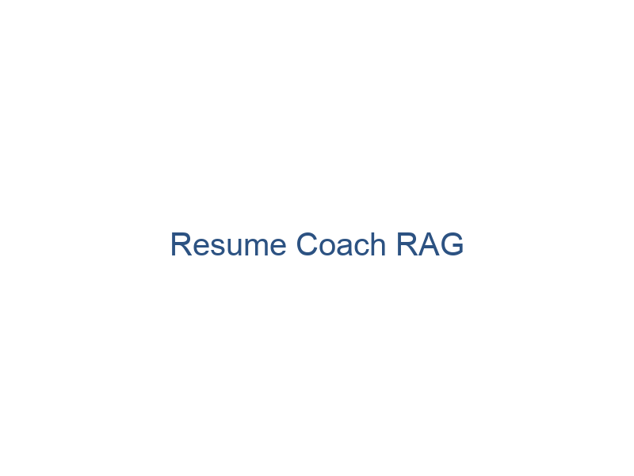

# Resume Coach RAG
## AI-Powered Resume Analysis and Job Market Insights

---

# The Problem

- Job seekers struggle to tailor resumes
- Manual tailoring is time-consuming
- ATS systems filter resumes before human review
- Many don't know how to improve keyword relevance

---

# RAG Process

01 Step 1 - User uploads resume and job description

02 Step 4 - Resume enhanced with relevant keywords and tailored to job description

03 Step 2 - Resume and job description parsed into plain text

04 Step 3 - Relevant skills, experience and keywords extracted from text

---

# Tools & Stacks

Language/Frameworks | Libraries | Platform
---|---|---
Python | PyPDF2, docx2txt, | Streamlit for UI
Streamlit (front end) | LangChain, FAISS | Docker deployment

Dev tools used: VS Code, GitHub, Docker

---

# Implementation Details

- Frontend: Streamlit UI
- Backend: Python, RAG pipeline
- Modeling: RAG pipeline (retrieval + LLM inference)
- Parsing: PyPDF2 and docx2txt
- Infrastructure: Docker with multi-stage builds
- Version Control: GitHub

---

# Data Ingestion & Parsing

- Upload resumes in PDF/DOCX
- Extract text using NLP parsers
- Process through RAG pipeline
- Output: Enhanced resume with market insights

---

# Market Analysis Features

- Real-time job market analysis via Adzuna API
- Location-based salary insights
- Skills demand tracking
- Industry trends analysis
- Company hiring patterns

---

# Future Enhancements

- Predictive career pathing
- Custom industry analytics
- Global market expansion
- Advanced skills matching
- Interview preparation assistance

---

# Thank You!

## Contact Information
- **Name:** Dawnena Key
- **Email:** dawnena.key@du.edu
- **GitHub:** [@dawnenakey](https://github.com/dawnenakey/resume-coach-rag)

 