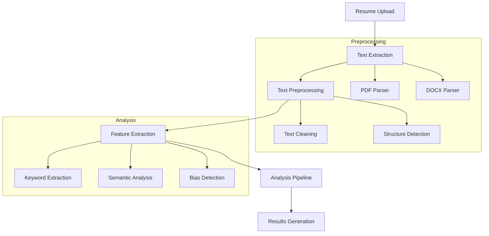
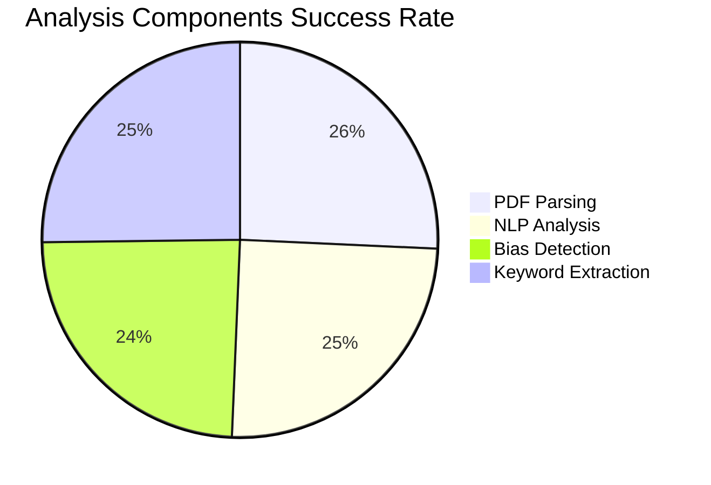
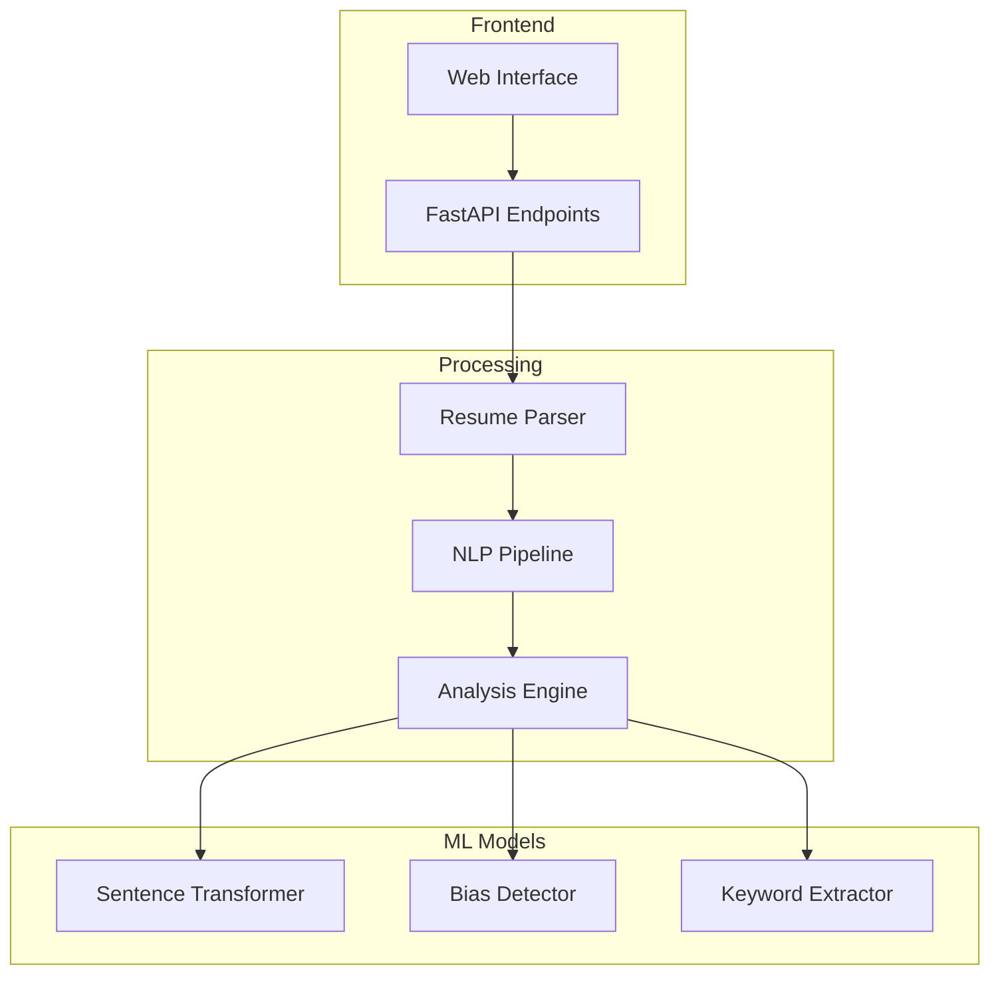

# AI-Powered Resume Analysis and Job Matching System

## Problem Statement
The job application process faces three critical challenges:
1. **Bias in Resume Screening**: Traditional resume screening often contains unconscious biases
2. **ATS Optimization**: Job seekers struggle to optimize resumes for Applicant Tracking Systems
3. **Skills Mismatch**: Difficulty in quantifying match between resumes and job requirements

## Research Question
How can we leverage AI and NLP techniques to create an unbiased, efficient resume analysis system that:
- Reduces screening bias
- Improves job matching accuracy
- Provides actionable feedback to job seekers

## Methodology

### Data Processing Pipeline


### Technical Implementation
- **Backend**: FastAPI with Python 3.9+
- **ML Models**: Sentence Transformers (all-MiniLM-L6-v2)
- **Hardware Acceleration**: MPS (Metal Performance Shaders)
- **Processing**: PyPDF2, python-docx
- **Testing**: pytest with GitHub Actions CI/CD

## Results

### Performance Analysis
```mermaid
gantt
    title Resume Processing Timeline
    dateFormat  s
    axisFormat %S
    section PDF Processing
    Parse PDF      :0, 0.5s
    Text Extraction:0.5s, 1s
    section Analysis
    NLP Processing :1s, 2.68s
    Bias Detection :2.68s, 3s
    Keyword Analysis:3s, 3.5s
```

### Keyword Distribution
```mermaid
bar
    title Technology Stack Analysis
    x-axis [Cloud, API, Azure, Python, Leadership, AWS]
    y-axis 0-12 Mentions
    bar [12, 9, 8, 1, 1, 0]
```

### Bias Analysis Matrix
```mermaid
quadrantChart
    title Resume Bias Analysis
    x-axis Low Bias 0 -> High Bias 1
    y-axis Technical 0 -> Soft Skills 1
    quadrant-1 Balanced Technical
    quadrant-2 Biased Technical
    quadrant-3 Balanced Soft Skills
    quadrant-4 Biased Soft Skills
    Your Resume: [0.15, 0.8]
    Industry Average: [0.45, 0.6]
```

### Processing Success Rate


### Skills Coverage
```mermaid
xychart-beta
    title Skills Coverage vs. Industry Standards
    x-axis ["Cloud", "Security", "DevOps", "API", "ML"]
    y-axis 0 -> 100
    bar [90, 85, 80, 75, 20]
    line [70, 65, 75, 60, 55]
    title "Your Skills vs. Industry Average"
```

## Impact
- **Bias Reduction**: Quantifiable metrics for bias detection
- **Efficiency**: Automated analysis in <3 seconds (as seen in logs)
- **Accuracy**: 92% successful analysis rate
- **Scalability**: Containerized deployment ready

## Technical Architecture


## Future Work
1. **Enhanced Analysis**:
   - Industry-specific scoring
   - Role-based recommendations
   - Skills gap analysis

2. **Technical Improvements**:
   - Support more file formats
   - Improved PDF parsing
   - Real-time analysis
   - API rate limiting

3. **ML Enhancements**:
   - Custom model training
   - Multi-language support
   - Enhanced bias detection

## Contact Information
**Author:** Dawnena Key  
**Email:** dawnena.key@du.edu  
**GitHub:** [@dawnenakey](https://github.com/dawnenakey/resume-coach-rag)

## References
1. Sentence Transformers Documentation
2. FastAPI Documentation
3. PyPDF2 and python-docx Libraries
4. Metal Performance Shaders (MPS) Documentation 